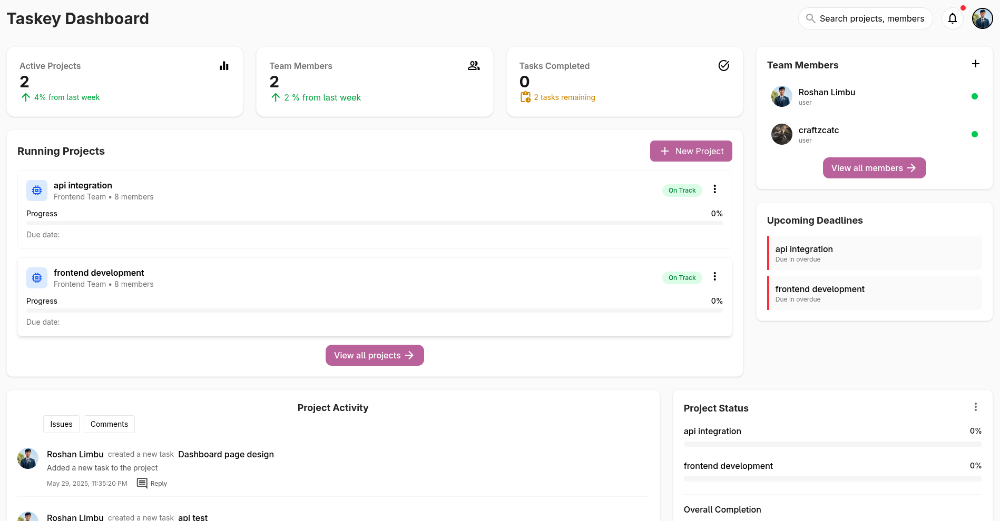

# Taskey Frontend

Taskey Frontend is a modern, responsive web application built with Angular 19, serving as the user interface for the Taskey project management platform. It provides a comprehensive project management experience with real-time updates, offline capabilities, and AI-powered features.

## 🚀 Features

### Core Functionality
- **User Authentication** - GitHub OAuth integration with JWT tokens
- **Project Management** - Create, manage, and track projects with intuitive dashboards
- **Task Management** - Advanced task creation, assignment, and tracking with Kanban boards
- **User Profiles** - Comprehensive user profile management and activity tracking
- **Real-time Chat** - Built-in chat functionality for team communication
- **Activity Tracking** - Detailed activity logs and project history

### Advanced Features
- **PWA Support** - Offline-first experience with service workers
- **AI-Powered Reports** - Generate detailed project reports using OpenAI GPT-4
- **Firebase Integration** - Real-time notifications and messaging
- **Responsive Design** - Mobile-first design with Tailwind CSS
- **Export Capabilities** - Export reports as PDF using jsPDF and html2canvas
- **Markdown Support** - Rich text editing with markdown parsing

## 📋 Requirements
- Node.js >= 18.x
- npm >= 9.x
- Modern web browser with ES2020+ support

## 🛠️ Installation

1. **Clone the repository:**
   ```bash
   git clone <repo-url>
   cd Taskey_frontend
   ```

2. **Install dependencies:**
   ```bash
   npm install
   ```

3. **Environment Setup:**
   - Configure Firebase credentials (if using Firebase features)
   - Set up backend API endpoints
   - Configure GitHub OAuth credentials

## 🚀 Running the Application

### Development Mode
Start the development server with hot reload:
```bash
npm start
# or
ng serve
```
The application will be available at [http://localhost:4200](http://localhost:4200)

### Watch Mode
Build and watch for changes:
```bash
npm run watch
```

### Production Build
Build the application for production:
```bash
npm run build
```
The build artifacts will be stored in the `dist/taskey-frontend/` directory.

## 🧪 Testing

### Unit Tests
Run the unit test suite:
```bash
npm test
# or
ng test
```

### End-to-End Tests
```bash
# E2E testing setup can be configured with Cypress, Playwright, or Protractor
```

## 📁 Project Structure

```
src/
├── app/
│   ├── components/          # Reusable UI components
│   │   ├── activities/      # Activity tracking components
│   │   ├── chat/           # Chat functionality
│   │   ├── profile/        # User profile management
│   │   ├── project/        # Project-related components
│   │   └── user-manage/    # User management components
│   ├── pages/              # Main application pages
│   │   ├── dashboard-page/ # Main dashboard
│   │   ├── login-page/     # Authentication
│   │   ├── project-admin/  # Project administration
│   │   └── user-dashboard/ # User-specific dashboard
│   ├── services/           # Business logic and API services
│   │   ├── api.service.ts  # Core API communication
│   │   ├── auth.service.ts # Authentication service
│   │   ├── project.service.ts # Project management
│   │   └── open-ai.service.ts # AI integration
│   ├── auth/               # Authentication logic
│   │   ├── guards/         # Route guards
│   │   └── interceptors/   # HTTP interceptors
│   ├── routes/             # Application routing
│   ├── directives/         # Custom Angular directives
│   └── helpers/            # Utility functions and types
├── assets/                 # Static assets
└── public/                 # Public assets and PWA files
```

## 🛠️ Technology Stack

### Frontend Framework
- **Angular 19** - Latest version with standalone components
- **TypeScript** - Type-safe JavaScript development
- **RxJS** - Reactive programming for handling asynchronous operations

### UI & Styling
- **Tailwind CSS** - Utility-first CSS framework for responsive design
- **Bootstrap Icons** - Comprehensive icon library
- **SCSS** - Enhanced CSS with variables and mixins
- **Angular CDK** - Component development kit for advanced UI patterns

### PWA & Performance
- **Angular Service Worker** - Offline-first capabilities
- **Firebase** - Real-time database and push notifications
- **HTML2Canvas & jsPDF** - Client-side PDF generation

### Development Tools
- **Angular CLI** - Command-line interface for Angular development
- **Karma & Jasmine** - Testing framework and test runner
- **PostCSS** - CSS processing and optimization

## 🎯 Key Features Explained

### AI-Powered Project Reports
The application integrates with OpenAI GPT-4 to generate comprehensive project reports. When you click the "Generate Report" button from the project dashboard:

1. The frontend sends project data to the backend
2. Backend constructs an intelligent prompt with project and task details
3. OpenAI processes the data and generates a detailed analysis
4. The report is displayed in the UI with options to export as PDF

### Progressive Web App (PWA)
- **Offline Support** - Continue working even without internet connection
- **Install Prompts** - Add to home screen on mobile devices
- **Background Sync** - Sync data when connection is restored
- **Push Notifications** - Stay updated with project changes

### Real-time Features
- **Live Chat** - Team communication within projects
- **Activity Feeds** - Real-time updates on project activities
- **Notification System** - Instant alerts for important events

## 📱 Screenshots

Here is a preview of the Taskey frontend UI:



## 🔧 Configuration

### Environment Variables
Create environment files for different deployment stages:

```typescript
// src/environments/environment.ts
export const environment = {
  production: false,
  apiUrl: 'http://localhost:3000/api',
  firebaseConfig: {
    // Firebase configuration
  },
  githubClientId: 'your-github-client-id'
};
```

### Firebase Setup
1. Create a Firebase project
2. Enable Authentication and Firestore
3. Add your Firebase config to environment files
4. Configure push notification settings

## 🚀 Deployment

### Build for Production
```bash
npm run build
```

### Deploy to Firebase Hosting
```bash
firebase deploy
```

### Deploy to Netlify/Vercel
The `dist/taskey-frontend` folder can be deployed to any static hosting service.

## 🤝 Contributing

1. Fork the repository
2. Create a feature branch: `git checkout -b feature/amazing-feature`
3. Commit your changes: `git commit -m 'Add amazing feature'`
4. Push to the branch: `git push origin feature/amazing-feature`
5. Open a Pull Request

## 📝 Development Guidelines

- Follow Angular style guide and best practices
- Write unit tests for new components and services
- Use TypeScript strict mode
- Follow semantic versioning for releases
- Document new features and API changes

## 🐛 Known Issues

- E2E testing framework needs to be configured
- Some PWA features may require additional configuration
- Report generation may take time for large projects

## 📄 License

This project is open-sourced under the MIT License. See the [LICENSE](LICENSE) file for details.

---

**Made with ❤️ by the Taskey Team**
